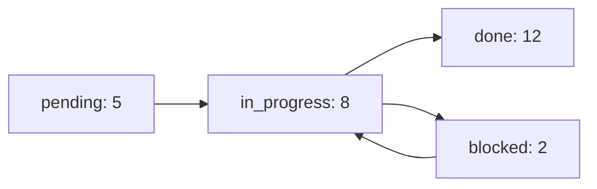

# task-canvas-analysis SOP · 任务看板分析（v1.1）

> **阶段**：05 任务派发
> **目标**：用看板分析任务健康度

---

## 🎯 触发条件

- ✅ 任务板 ≥ 10 个任务
- ✅ Sprint 中期（每个 Sprint 中段做 1 次）
- ✅ 任务阻塞需要全局视角
- ✅ 周会 / 日会前

## 🛠️ 操作步骤（5 步）

### 第 1 步：拉取任务板快照

```
task_tool.py list --status in_progress,blocked,pending

输出：
| ID | 标题 | 状态 | 责任 | 创建时间 | 截止时间 | 阻塞原因 |
```

### 第 2 步：分析 5 个维度

| 维度 | 问题 | 健康指标 |
|:--|:--|:--|
| **吞吐** | 今日完成 / 总任务 | > 5% / 天 |
| **阻塞率** | blocked / in_progress | < 10% |
| **逾期率** | overdue / all | < 5% |
| **平均周期** | 创建到完成的平均时长 | < 7 天 |
| **派工均衡** | 每个 agent 的任务数 | < 1.5x 平均 |

### 第 3 步：识别风险

```
风险信号：
- 1 个任务阻塞 > 24h → 戳破
- 1 个 agent 任务数 > 1.5x 平均 → 减压
- 1 个 Sprint 完成率 < 70% → 调整范围
- 关键路径阻塞 → 立即升级
```

### 第 4 步：可视化



### 第 5 步：输出看板分析报告

```markdown
# 任务看板分析 · YYYY-MM-DD

## 整体健康度
- 吞吐：X / Y
- 阻塞率：X%
- 逾期率：X%
- 平均周期：X 天

## 风险点
- [风险 1]
- [风险 2]

## 建议动作
- [动作 1]
- [动作 2]
```

## ✅ 验收 Checklist

- [ ] 5 维度全分析？
- [ ] 风险点 ≥ 3 个？
- [ ] 建议动作明确？
- [ ] 看板分析每周 1 次？

## 🩸 反范式

- **只看 done 数**（不看阻塞）→ 漏掉风险
- **不识别关键路径** → 误判项目健康
- **不减压负载高的 agent** → 单点风险

## 🔗 相关链接

- 平行：[agent-task-board SOP](../agent-task-board/SOP.md)
- 阶段：[05 任务派发](../../README.md#05-任务派发)

---

*锁版守：5 维度分析 + 风险信号识别 + 周报节奏*